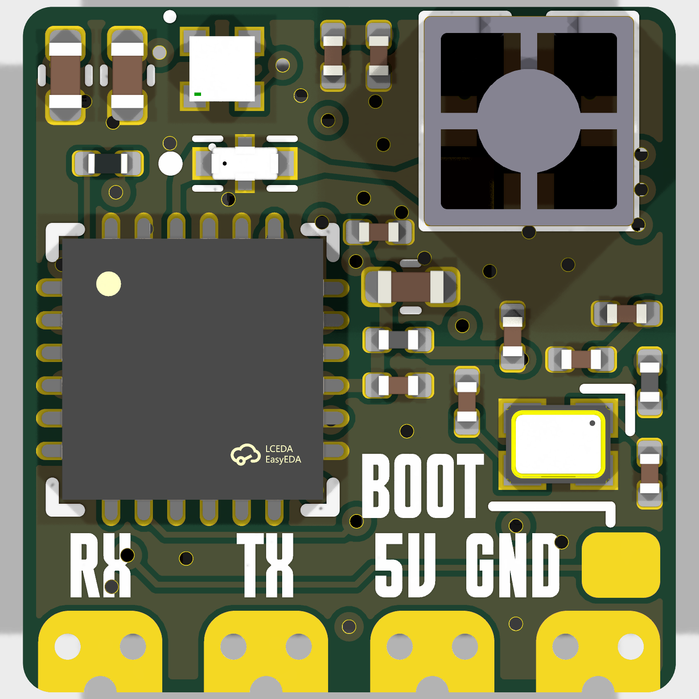
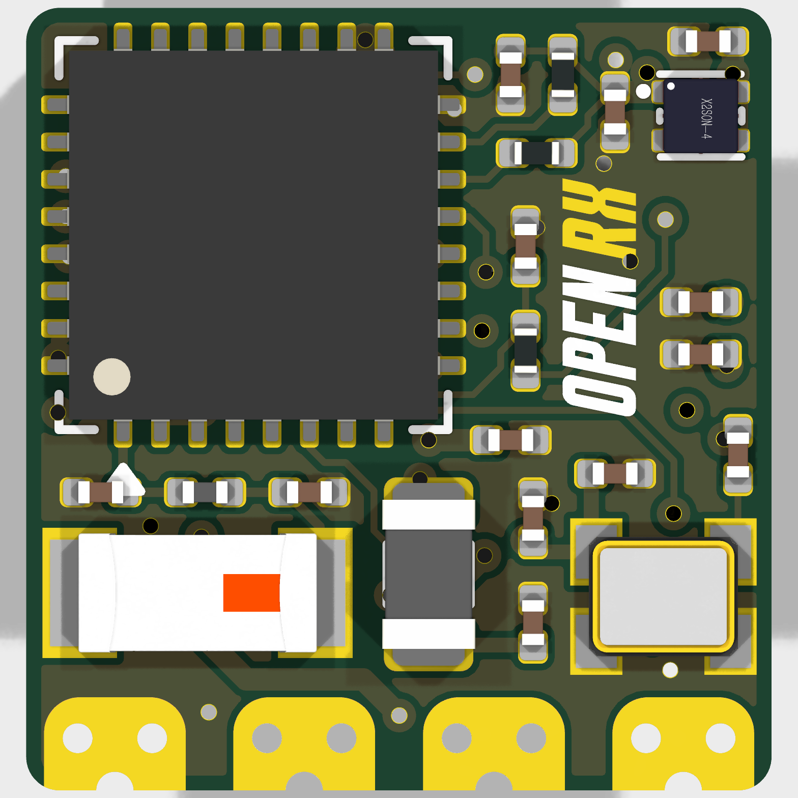

# OpenRX-Lite

ESP32-C3 + SX1281, 2.4 GHz only, on-board chip antenna. Same circuit as Lite-UFL, different antenna interface.

## Board preview

| Front | Back |
|-------|------|
|  |  |

## Schematic

- Main sheet: `esp32c3_sx1281_lite.kicad_sch`
- RF chain: `SX1281 (U3) RFIO -> 2450FM07D0034T (FL1) -> 47948-0001 chip antenna (AE2)`
- AE1 (2450AT18A100E) is the ESP32-C3 Wi-Fi antenna, not the ELRS link antenna
- No RF front-end (PA/LNA), no RF switch, no sub-GHz

### GPIO map

From `shared/elrs-targets/OpenRX Lite 2400.json`: serial 20/21, radio SPI MISO 5 / MOSI 4 / SCK 6 / NSS 7, BUSY 3, DIO1 1, RST 2, RGB LED 8 (GRB).

### No boot button

GPIO 9 pull-up only, no physical switch.

## Firmware

- ELRS target: `Unified_ESP32C3_2400_RX`
- Hardware JSON: `/shared/elrs-targets/OpenRX Lite 2400.json`
- Max TX power 13 dBm

## Flash interface

- Pads: `5V`, `GND`, `RX`, `TX`
- `BOOT` pad (TP5): short to GND during power-up to enter UART download mode
- Wi-Fi OTA after first flash. Full procedures: [../FLASHING.md](../FLASHING.md)

## Sourcing

- All parts LCSC basic/preferred where possible
- `C2651081` 2450FM07D0034T: 2.4 GHz band-pass filter
- `C2151551` SX1281IMLTRT: watch stock for volume runs
- `C152351` 47948-0001: Molex chip antenna
